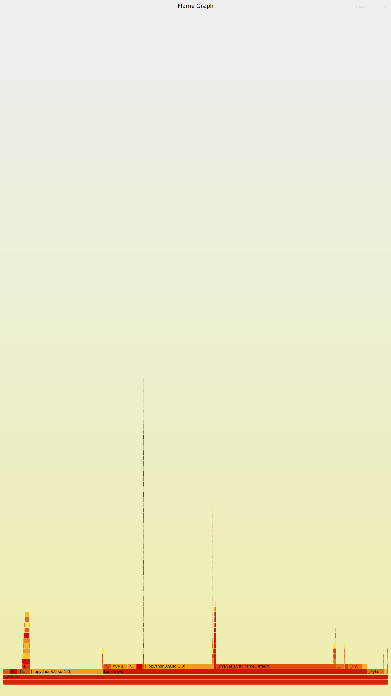

## Step 2: Profile the Application with perf and FlameGraph

In this step we will use **perf** and **FlameGraph** to analyze performance of our containerized Python/Flask app.

---

### 1. Load Testing the Application

Keep the Flask container running from **Step 1**.

Run a workload generator in another terminal to stress the `/compute` endpoint:

```bash
wrk -t2 -c20 -d30s http://localhost:5000/compute
```

- `-t2` = 2 threads  
- `-c20` = 20 concurrent connections  
- `-d30s` = run test for 30 seconds  

This ensures the application is busy and generates enough samples for profiling.

---

### 2. Profiling with perf (CPU FlameGraph)

Find the container’s main process PID on the host:

```bash
docker inspect --format '{{.State.Pid}}' flask-app
```

Run `perf` against that PID:

```bash
sudo perf record -F 99 -p <host_pid> -g -- sleep 30
sudo perf script > out.perf
```

Install FlameGraph tools (if not done already):

```bash
git clone https://github.com/brendangregg/Flamegraph.git
```

Generate the folded stacks and FlameGraph:

```bash
./Flamegraph/stackcollapse-perf.pl out.perf > out.folded
./Flamegraph/flamegraph.pl out.folded > flamegraph.svg
```

Now download `flamegraph.svg` and open it in your browser. The file is interactive:  

- **Y-axis = Call stack depth**  
  Each row is one stack frame (a function). The **top block** is the function currently executing, and the blocks below are its parents (callers). The deeper the stack, the taller the flame.  

- **X-axis = Aggregated samples**  
  The width of a block shows how often that function appeared in collected samples. A wider block means the function consumed more cumulative CPU time.  
  ⚠️ Important: the X-axis is **not a time axis**. Functions are laid out alphabetically after merging stacks, so horizontal position has no chronological meaning.  

- **Colors**  
  By default, colors are only for visual distinction between functions. They do not represent heat, duration, or resource type (unless using a customized palette).  

- **How to read it**  
  - **Wide blocks** → functions where most CPU time is spent.  
  - **Tall spikes** → deep call stacks, often from recursion or nested calls.  
  - To investigate a hotspot, start at the wide block on top and trace downward to see which functions led there.  


---

### 3. Interpreting the FlameGraph

Typical observations:

- **Wide blocks** = loops or frequently executed functions.  
- **Tall spikes** = recursive functions (e.g. our `fibonacci(n)`), because each call adds another stack frame.  
- **`_PyEval_EvalFrameDefault`** = Python interpreter main loop (expected in Python workloads).  
- **`_PyLong_New`, `PyNumber_InPlaceAdd`** = Python integer object creation and arithmetic.  
- **`[libpython3.9.so.1.0]`** = calls into Python C API.  

There is the svg result we produced:

---

✅ At this point, you should have produced a `flamegraph.svg` file that visually demonstrates where your Python/Flask app spends CPU time under load.
